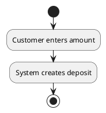
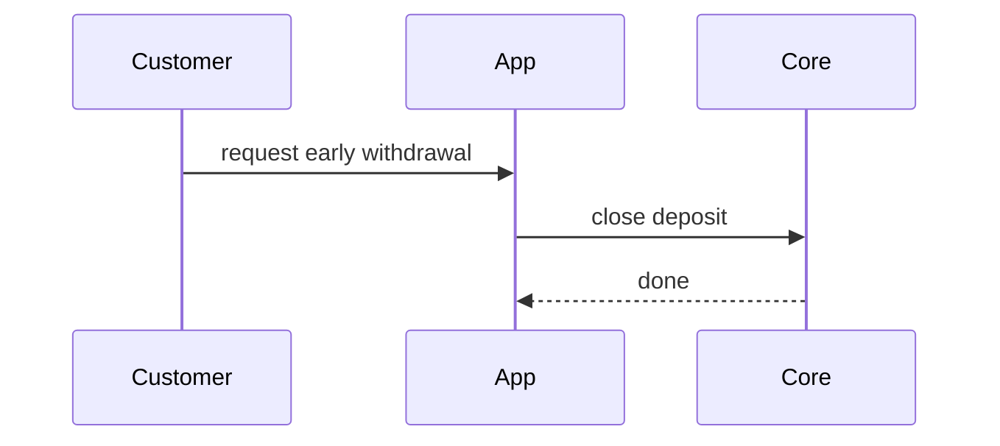

# BRD — Online Savings Deposit

We want customers to open savings deposits in the mobile app.

## Requirements

- The customer opens a savings deposit and the system confirms it.
- A 4.8% annual interest rate is applied to the deposit.
- The service writes idempotent double-entry ledger postings to the GL and accrual
  tables for each customer cohort, with grandfathered rate handling per the
  posting schema.
- We will raise the minimum opening balance to 5,000,000 VND next quarter.
- An interest job runs to update balances.
- Deposit states are: active, matured, closed.
- The customer picks an amount and a source account, then the money is moved and
  the deposit becomes active.
- If opening fails, show an error.

## Flows

### Diagrams

Activity diagram (open deposit):

Sequence diagram (early withdrawal):

## Scope

In scope: opening a savings deposit on mobile.

## Notes

- Success means customers like the feature.
