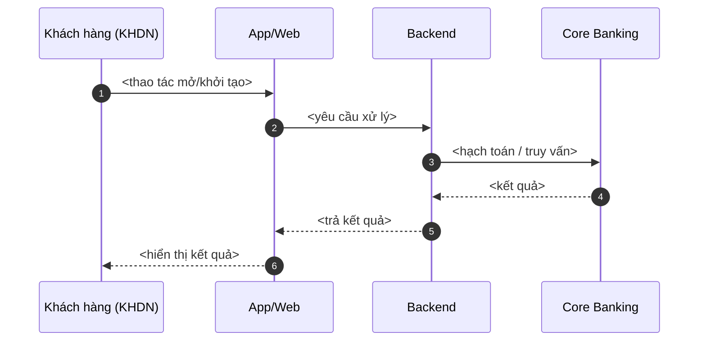
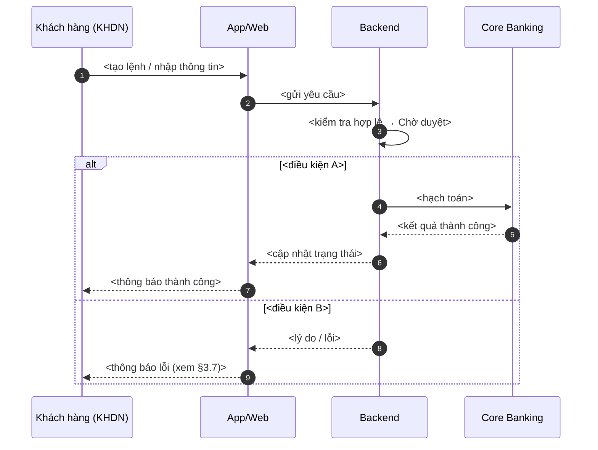
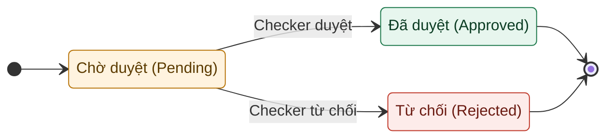

<!-- Generated by finalize on <date>. Source: clarify-output/*. Output file: clarify-output/urd.md (NOT "final-urd.md"). -->
<!-- HEADINGS render in the Document Profile Language (Principle 13.3). Default Language=vi, so headings
     render as "Tiếng Việt (English term)", e.g. "Tổng quan (Overview)". When Language=en, the English
     term only. IDs / labels / error codes / flow names / field EN names / file names ALWAYS stay English. -->
<!-- DIAGRAMS ARE MERMAID-ONLY (Principle 13, URD): sequence = `sequenceDiagram` + `autonumber`, no color;
     state = `stateDiagram-v2` with colored classDef. No PlantUML. -->
<!-- §3 IS A REPEATING BLOCK: copy the whole "## 3." section for each business process (nghiệp vụ);
     keep numbering 3, 4, 5 contiguous. Section numbers auto-follow this skeleton; do not renumber by hand. -->
<!-- Leave one blank line between any label/paragraph and a table directly below it (Principle 13.12). -->

# <Tên phân hệ / nghiệp vụ> — Tài liệu Đặc tả Yêu cầu Người dùng (User Requirements Document — URD)

## Thông tin tài liệu (Document control)

| Hạng mục (Item) | Nội dung (Value) |
| --- | --- |
| Tên dự án | <e.g. Digital Banking — Khối KHDN> |
| Mã tài liệu | URD-XXX-vY.Z |
| Phiên bản | <e.g. 1.0> |
| Ngày lập | <dd/mm/yyyy> |
| Người lập (BA) | <name> |
| Người đánh giá | <name> |
| Người phê duyệt | <name> |
| Trạng thái | <Draft — chưa duyệt / Sẵn sàng duyệt / Đã duyệt> |
| Quality stamp | score <NN>/100 — band: <band> OR not run |

### Lịch sử thay đổi (Change history)

| Phiên bản | Ngày | Nội dung thay đổi | Người thực hiện | Người duyệt |
| --- | --- | --- | --- | --- |
| 1.0 | <dd/mm/yyyy> | Tạo mới tài liệu | <BA> | <Lead> |
<!-- finalize never overwrites silently: the previous file is archived as urd.v<N>.md, Version bumps,
     and a row is added here citing the driver (answer sheet vN / CR-nn). urd.md always holds the latest. -->

> Tổng hợp từ các kết quả đã chốt. Mục đánh dấu `ASSUMPTION` / `OPEN QUESTION` là chưa được giải quyết.
> Trạng thái không bao giờ là `Đã duyệt` khi còn finding mức blocker.

## Mục lục (Table of contents)
<!-- Bản HTML/Word tự sinh mục lục (pandoc --toc). Trong Markdown để dòng ghi chú này; không tự đánh số trang. -->

## 1. Tổng quan (Overview)

### 1.1. Giới thiệu (Introduction)
<Một đến hai câu: tài liệu mô tả gì, thuộc phân hệ/nghiệp vụ nào, dành cho ai đọc (BA, Dev, QA, nghiệp vụ).>
**Đọc nhanh:** xem §1 Tổng quan → §2 Tổng quan hệ thống → từng §3 nghiệp vụ → §5 Câu hỏi mở. Sơ đồ ở §2.3
và §3.3/§3.4 hiển thị trực quan ở bản `urd.html` (Mermaid render phía client).

### 1.2. Đối tượng sử dụng / Phạm vi triển khai (Users / Scope)
- **Nền tảng (Platform):** <Web (Internet Banking) / Mobile App / cả hai>
- **Đối tượng (Users):** <Khách hàng doanh nghiệp: Maker, Checker, Corp Admin / Nhân viên ngân hàng>
- **Ngoài phạm vi (Out of scope):** <liệt kê nếu có>

### 1.3. Định nghĩa thuật ngữ & từ viết tắt (Glossary)
Định nghĩa mỗi thuật ngữ một lần (chỉ những thuật ngữ tài liệu thực sự dùng).

| Thuật ngữ / Viết tắt | Giải thích |
| --- | --- |
| <core term> | <giải thích một dòng> |

**Ký hiệu (Symbol conventions)** — mã giữ **ổn định giữa các phiên bản**; tên bên cạnh chỉ để dễ đọc.

| Ký hiệu | Ý nghĩa | Ví dụ |
| --- | --- | --- |
| `F0n-Name` | Một luồng nghiệp vụ (số là anchor ổn định; tên để đọc) | `F02-Login` |
| `US-#` | Một user story | `US-01` |
| `BR#` | Một quy định / ràng buộc nghiệp vụ | `BR3` |
| `ERR-*` | Một mã lỗi / tình huống ngoại lệ | `ERR-TBAL-001` |
| `A#` / `Q#` / `S#` | Assumption / Open Question / Suggestion | `A1` / `Q2` / `S1` |

## 2. Tổng quan về hệ thống (System overview)

### 2.1. Mục tiêu của hệ thống / tính năng (Objectives & success criteria)
- Mục tiêu nghiệp vụ: <…>
- Tiêu chí thành công / KPI đo được: <…>

### 2.2. Danh sách nhóm người sử dụng (User groups)
Một dòng cho mỗi nhóm người dùng liên quan (gồm cả back-office / vận hành nếu có).

| Nhóm người dùng | Vai trò (Role) | Mô tả |
| --- | --- | --- |
| <Khách hàng DN> | Corp Admin | <quyền cao nhất trong DN; quản user, quy trình duyệt, hạn mức> |
| <Khách hàng DN> | Maker (Người tạo lệnh) | <khởi tạo giao dịch / yêu cầu, không duyệt> |
| <Khách hàng DN> | Checker (Người phê duyệt) | <duyệt / từ chối; ký điện tử nếu có> |
| <Ngân hàng> | <Teller / Supervisor / Bank Admin> | <vai trò back-office tương ứng> |

### 2.3. Cách hệ thống vận hành — tổng quan (How the system works — overview)
Tường thuật end-to-end ngắn gọn để người đọc lần đầu nắm toàn cảnh trước khi vào chi tiết từng nghiệp vụ
ở §3. Soạn từ journey; không bịa bước.

**Xem / chỉnh:** https://mermaid.live/

## Quy ước trình bày sơ đồ (Diagram conventions)
Áp dụng cho mọi sơ đồ trong §3. **Sơ đồ đặt TRƯỚC, bảng mô tả đặt SAU.**

- **Ngôn ngữ:** viết tiếng Việt CÓ DẤU trong sơ đồ.
- **Đặt tên tác nhân thống nhất:** `Backend` (lớp backend), `Core Banking` (hệ thống lõi),
  `App/Web` (giao diện người dùng), `Đối tác ngoài` (external partner — ví dụ tổ chức thẻ, payment network).
- **Sequence diagram:** bắt đầu bằng `sequenceDiagram` rồi `autonumber`; **KHÔNG tô màu** (participant phẳng).
- **State diagram:** dùng `stateDiagram-v2`; **tô màu** trạng thái bằng `classDef`
  (khởi tạo = xanh dương, trung gian/chờ = vàng, thành công = xanh lá, từ chối/lỗi = đỏ).

## 3. <Tên nghiệp vụ> (<Business process — English name>)
<!-- KHUÔN LẶP LẠI — sao chép toàn bộ §3 cho mỗi nghiệp vụ. Đổi tiêu đề & giữ số mục 3/4/5 liền mạch. -->

### 3.1. Mô tả nghiệp vụ (Description)

| Tiêu chí | Mô tả chi tiết |
| --- | --- |
| Mục tiêu | <tính năng giải quyết nhu cầu gì> |
| Phạm vi áp dụng | <đối tượng + nền tảng Web/Mobile> |
| Đối tượng sử dụng | <Maker, Checker, Corp Admin… / chỉ xem> |
| Nền tảng | <Web / Mobile / cả hai> |

### 3.2. User stories / Use cases
Mỗi dòng: vai trò + mong muốn + lợi ích + tiêu chí chấp nhận. Suy ra từ các requirement đã chốt; không bịa
(thiếu thông tin → ghi `ASSUMPTION` / `OPEN QUESTION`).

| ID | Là (vai trò) | Tôi muốn | Để | Tiêu chí chấp nhận |
| --- | --- | --- | --- | --- |
| US-01 | <Maker> | <hành động> | <lợi ích> | <điều kiện được xem là đạt> |
| US-02 | <…> | <…> | <…> | <…> |

### 3.3. Luồng xử lý nghiệp vụ (Process flow)
Sơ đồ tuần tự (Mermaid sequence) đặt TRƯỚC, bảng bước đặt SAU; số bước khớp `autonumber`. Nghiệp vụ nhiều
luồng → tách 3.3.1, 3.3.2… mỗi luồng một sơ đồ + một bảng. Đặt tên luồng `F0n-Name`.

**Xem / chỉnh:** https://mermaid.live/

**Mô tả các bước xử lý (đọc theo sơ đồ trên):**

| Bước | Vai trò | Hành động | Mô tả xử lý / Kết quả |
| --- | --- | --- | --- |
| 1 | <Maker> | <Tạo lệnh / nhập thông tin> | <Hệ thống kiểm tra hợp lệ → Chờ duyệt> |
| 2 | <Hệ thống> | <Định tuyến cấp duyệt> | <theo hạn mức / cấp duyệt đã cấu hình (BR..)> |
| 3 | <Checker> | <Duyệt / Từ chối> | <xác thực Smart OTP / Secure Code> |

Quy định: BR.. (§3.5). Lỗi / thông báo / xử lý: §3.7.

### 3.4. Trạng thái xử lý (State model)
Sơ đồ trạng thái (Mermaid state, có tô màu) đặt TRƯỚC, bảng mô tả trạng thái đặt SAU.

**Bảng mô tả trạng thái:**

| Trạng thái (VN) | Trạng thái (EN) | Mô tả | Hành động cho phép |
| --- | --- | --- | --- |
| Chờ duyệt | Pending approval | <…> | <Maker: hủy> |
| Đã duyệt | Approved / Processing | <…> | — |
| Từ chối | Rejected | <…> | <Maker: tạo lại> |

### 3.5. Quy định & ràng buộc nghiệp vụ (Business rules)
Liệt kê rule cụ thể (giới hạn, hạn mức, ngưỡng, định dạng, điều kiện hợp lệ…). Cái chưa rõ → `OPEN QUESTION`.

- **BR1 —** <quy định cụ thể>
- **BR2 —** <…>

### 3.6. Danh sách & đặc tả màn hình (Screens & field specs)
Liệt kê TẤT CẢ màn hình của nghiệp vụ — mỗi màn một mục con. M = bắt buộc, O = tùy chọn. Maker–Checker thì
tách màn tạo lệnh và màn phê duyệt.

#### 3.6.1. Màn hình <Tên màn hình>

> Nền tảng: <Web/Mobile> · Actor: <Maker/Checker/…> · Mục đích: <…>

| Tên trường (EN) | Tên trường (VN) | Kiểu dữ liệu | M/O | Mô tả / Ràng buộc |
| --- | --- | --- | --- | --- |
| <fieldName> | <Tên trường> | <Text/Number/Dropdown/Radio/Date> | <M/O> | <giá trị, định dạng, validate, mặc định> |

### 3.7. Thông báo / lỗi / exception cases (Messages & errors)
Thành công, cảnh báo, lỗi validate, mã lỗi từ Core/đối tác ngoài, ngoại lệ (timeout, mất kết nối, vượt hạn mức…).
Mã lỗi giữ tiếng Anh theo §4.1. Thông điệp người dùng viết bằng ngôn ngữ đời thường.

| Trường hợp / Mã | Điều kiện xảy ra | Thông báo (VN) | Thông báo (EN) | Xử lý |
| --- | --- | --- | --- | --- |
| `ERR-XXX-001` | <điều kiện> | <…> | <…> | <chặn submit / fallback / cho thử lại> |

### 3.8. Yêu cầu phi chức năng (Non-functional requirements)
- **Bảo mật:** <xác thực, phân quyền, mã hóa, tuân thủ ND13/2023, TT50…>
- **Hiệu năng / đồng bộ:** <real-time, cache, thời gian phản hồi, nhất quán số liệu…>
- **Đa ngôn ngữ:** <VN/EN; định dạng số…>
- **Audit log:** <ghi vết thao tác / sự kiện nào>

## 4. Phụ lục (Appendix)

### 4.1. Quy tắc đặt mã / số tham chiếu (Ref code rules)
- Mã lỗi/ngoại lệ theo định dạng `ERR-<MODULE>-xxx` (ví dụ `ERR-TBAL-001`).
- <Quy tắc đánh mã giao dịch / yêu cầu nếu có.>

### 4.2. Tài liệu liên quan & Truy vết yêu cầu (Artifact index & traceability)
Bộ deliverable tinh gọn — chỉ liệt kê file thực sự tồn tại. Sơ đồ là **mã nguồn** render qua viewer trong
tài liệu (không sinh file ảnh). Truy vết trong-tài-liệu: Requirements/US ↔ Flow (`F0n-Name`) ↔ Quy định (BR)
↔ Lỗi (`ERR-*`).

| Artifact | Mô tả | Dùng khi (ai / khi nào) | Đường dẫn |
| --- | --- | --- | --- |
| Nguồn (tài liệu này) | Markdown master của URD | BA/PO — nguồn sự thật duy nhất; mọi chỉnh sửa ở đây | `clarify-output/urd.md` |
| Audit report | Điểm, band, findings | BA — kiểm tra chất lượng trước duyệt | `clarify-output/audit-report.md` |
| Wireframes | Wireframe low-fi HTML | Design/Dev — tham chiếu bố cục màn hình | `clarify-output/wireframes.html` |
| Bản lưu phiên bản | Các phiên bản trước | BA/PO — so sánh phiên bản cũ | `clarify-output/urd.v<N>.md` |
| URD HTML | Bản HTML render từ `urd.md` | Stakeholder — đọc/chia sẻ không cần Markdown | `clarify-output/urd.html` |
| URD Word | Bản .docx render từ `urd.md` | Stakeholder — đọc/ký bản Word | `clarify-output/urd.docx` |

## 5. Câu hỏi mở / Cần làm rõ (Open questions)
Gom mọi `OPEN QUESTION` còn lại. Mục chặn duyệt (blocker) đánh dấu rõ ở cột Trạng thái.

| # | Câu hỏi / điểm cần làm rõ | Người phụ trách | Trạng thái |
| --- | --- | --- | --- |
| 1 | OPEN QUESTION: <…> | <PM / BA / Compliance…> | Open / RESOLVED / BLOCKER |

## Phê duyệt (Sign-off)

| Người duyệt | Vai trò | Quyết định | Ngày |
| --- | --- | --- | --- |
| <name> | <role> | <Approved / Rejected> | <dd/mm/yyyy> |
