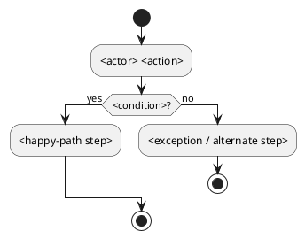
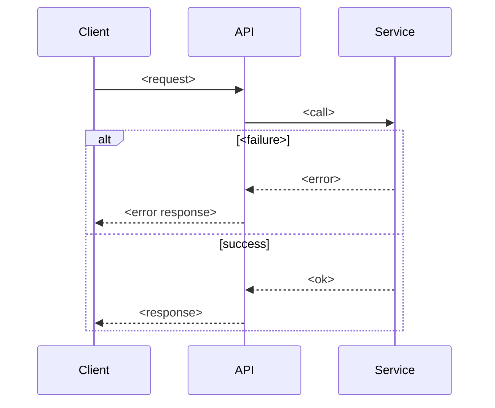
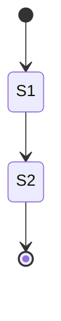
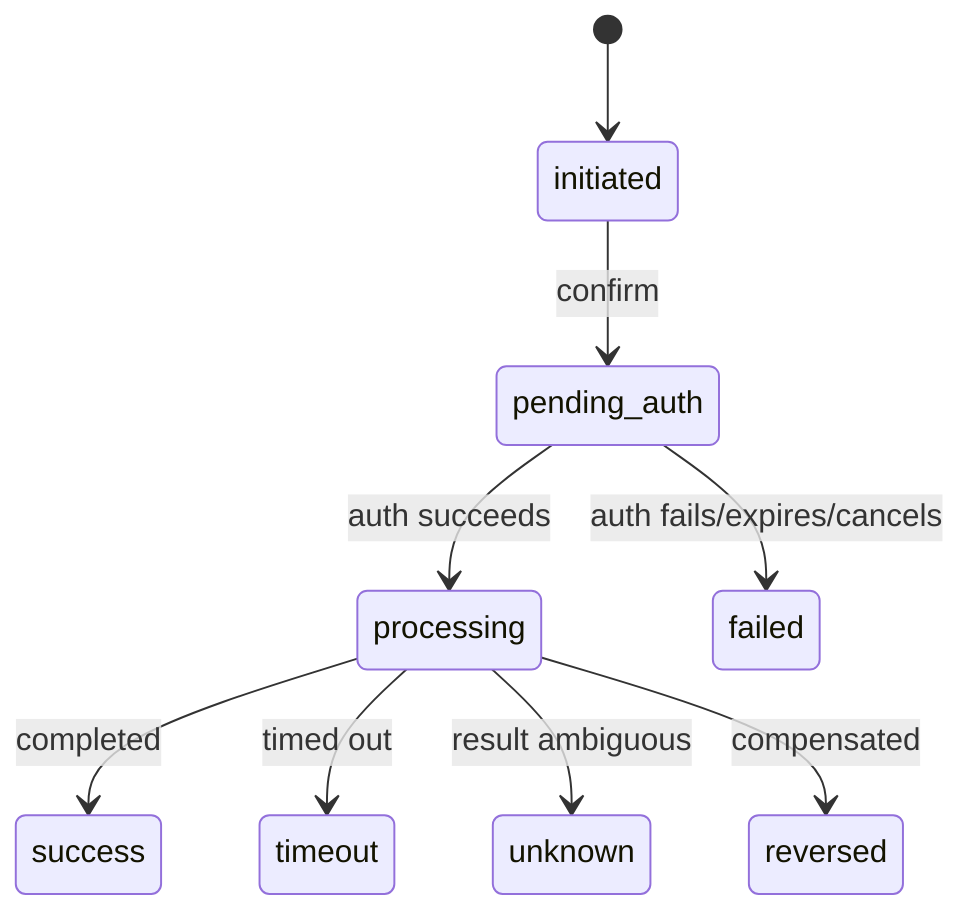

<!-- Generated by Clarify from-spec on <date>. Source: <input>. -->

# Model Suggestions (process-centric)

> Models are a gap-finding tool, not decoration. Diagrams are **source code** —
> paste them into the linked viewer to render. Clarify does not invent steps,
> rules, states, or error codes; unknowns are marked `OPEN QUESTION`.
>
> **Tool conventions (fixed):** Activity diagram = **PlantUML** (viewer:
> https://www.plantuml.com/plantuml, ref https://plantuml.com/) · Sequence
> diagram = **Mermaid** (viewer: https://mermaid.live/) · State diagram =
> **Mermaid** (viewer: https://mermaid.live/).
>
> **Rule:** within one flow block, the activity and the sequence must describe the
> **same business process**. Never place the activity of process A next to the
> sequence of process B (`mixed-process-diagram-block`).

## 1. Flow Catalog
The flows in scope (taken from the spec/scope — do not add out-of-scope flows).
| Flow ID | Business name | Actor(s) | Goal | Diagrams needed | Related rules (BR) | Related error codes | Requirement (BRD-Rxx) |
| --- | --- | --- | --- | --- | --- | --- | --- |
| F01 | <e.g. Open deposit> | <Customer> | <…> | activity + sequence |   | <codes> | <BRD-R01> |
| F02 | <…> | <…> | <…> | activity | <…> | <…> | <…> |

## 2. Flows

### Flow F01 — <Business name>
**2.1 Step-by-step**
| # | Actor | Action | System response | Rule / validation / error code |
| --- | --- | --- | --- | --- |
| 1 | <actor> | <action> | <response> |   |

**2.2 Activity diagram (PlantUML)** — business/process flow + decision branches

**View / edit:** https://www.plantuml.com/plantuml — ref: https://plantuml.com/

**2.3 Sequence diagram (Mermaid)** — system interaction for the **same** flow

**View / edit:** https://mermaid.live/
<!-- If the flow is simple / single-system: replace this block with
"Sequence diagram not required — <short reason>". -->

**2.4 Gaps revealed / Open questions**
- <gap or `OPEN QUESTION` surfaced by this flow — never invent a rule to fill it>

---

### Flow F02 — <Business name>
<repeat 2.1–2.4 for each flow in the catalog; keep activity + sequence about the
SAME process within this block>

## 3. State models
Model both levels when the feature has a process / async / risky / transactional
action; do not replace one with the other. For each, also note the **trigger**
(event that moves the state), the **owner system** (source of truth for the
state), and the **terminal** states — unknowns → `OPEN QUESTION`. (These feed the
State summary in the final document.)

### 3.1 Entity state (Mermaid)

**View / edit:** https://mermaid.live/

### 3.2 Transaction / operation state (Mermaid)

**View / edit:** https://mermaid.live/

**Gaps revealed:**
- <only entity state, no operation state (`missing-operation-state`); missing
  timeout/unknown/reversal; etc.>
