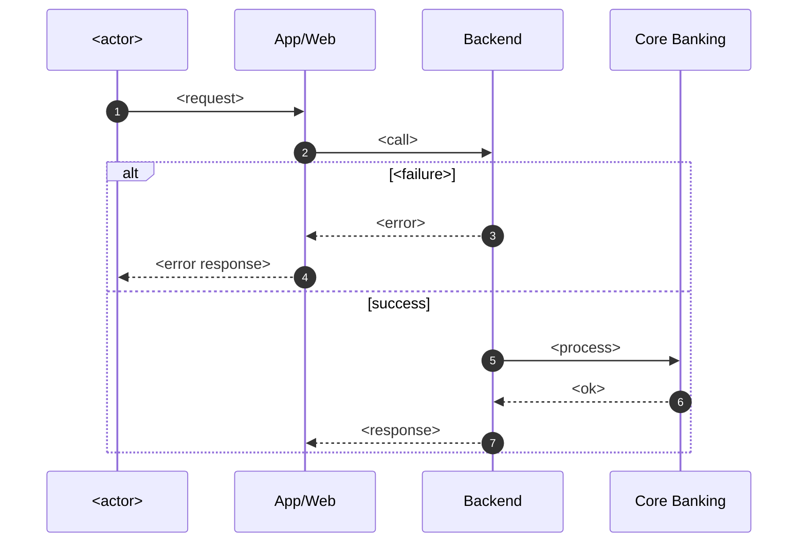
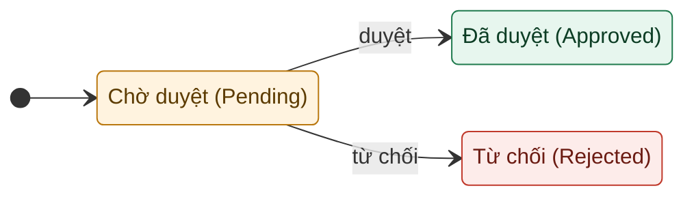

<!-- Working structure for the `modeling` engine (folded into the URD §3.3/§3.4 — no separate file). -->

# Model Suggestions (process-centric, Mermaid-only)

> Models are a gap-finding tool, not decoration. Diagrams are **source code** —
> paste them into the linked viewer to render. Clarify does not invent steps,
> rules, states, or error codes; unknowns are marked `OPEN QUESTION`.
>
> **Tool conventions (fixed — MERMAID ONLY):** Process flow = **Mermaid
> `sequenceDiagram`** + `autonumber`, no color (→ §3.3) · State diagram = **Mermaid
> `stateDiagram-v2`**, colored via `classDef` (→ §3.4). Viewer: https://mermaid.live/.
> **No PlantUML.**
>
> **Rule:** within one §3 block, the sequence (§3.3) and the state (§3.4) must
> describe the **same business process** (`mixed-process-diagram-block` otherwise).

## 1. Flow Catalog
The flows in scope (taken from the scope — do not add out-of-scope flows).

| Flow ID | Business name | Actor(s) | Goal | Related rules (BR) | Related error codes | User stories (US-#) |
| --- | --- | --- | --- | --- | --- | --- |
| F01-<Name> | <e.g. Open deposit> | <Customer> | <…> |   | <ERR-*> | <US-01> |
| F02-<Name> | <…> | <…> | <…> | <…> | <…> | <…> |

## 2. Flows

### Flow F01-<Name> — <Business name>
**Flow overview:** Goal — <…>; Primary actor — <…>; Trigger — <…>; Outcome — <…>.

**2.1 Sequence diagram (Mermaid)** — process flow + branches for THIS process

**View / edit:** https://mermaid.live/

**2.2 Steps (reading of the diagram above)**

| Bước | Vai trò | Hành động | Mô tả xử lý / Kết quả |
| --- | --- | --- | --- |
| 1 | <actor> | <action> | <response / branch> |

**2.3 Gaps revealed / Open questions**
- <gap or `OPEN QUESTION` surfaced by this flow — never invent a rule to fill it>

---

### Flow F02-<Name> — <Business name>
<repeat 2.1–2.3 for each flow in the catalog; keep the sequence + state about the
SAME process within this block>

## 3. State models (Mermaid, colored)
Model entity and/or transaction/operation state when the feature has a process /
async / risky / transactional action. Note the **trigger**, the **owner system**, and
the **terminal** states — unknowns → `OPEN QUESTION`. (Feeds §3.4.)

**View / edit:** https://mermaid.live/

**Gaps revealed:**
- <only entity state, no operation state (`missing-operation-state`); missing
  timeout/unknown/reversal; etc.>
