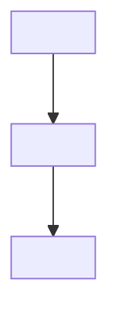

<!-- Generated by Clarify export on <date>. Source: final-brd §7.5 Screen/Display Matrix. -->

# Screen Inventory

One row per screen in the Screen/Display Matrix (§7.5). Do not invent screens; a
screen exists only if the matrix (or a flow step that shows a screen) implies it.
Unknowns → `OPEN QUESTION`.

| Screen ID | Screen | Serves Flow / Step | Purpose | Key fields / display | Primary CTA → action | Secondary actions | Validation / error codes | States (empty/loading/error/success) |
| --- | --- | --- | --- | --- | --- | --- | --- | --- |
| S01 | <name> | <F01 / step 3> | <…> | <…> | <CTA → action in flow> | <…> | <validation; error code(s) from §9.1, or OPEN QUESTION> | <from §9.2 state, or OPEN QUESTION> |

## Screen flow (navigation)
A Mermaid flowchart whose nodes are screens and edges are transitions taken from the
flow steps (no step → no edge). Rendered client-side in the HTML pack.

**View / edit:** https://mermaid.live/

## Gaps
- <screen referenced by a flow step but missing from the matrix, or vice versa →
  OPEN QUESTION>
