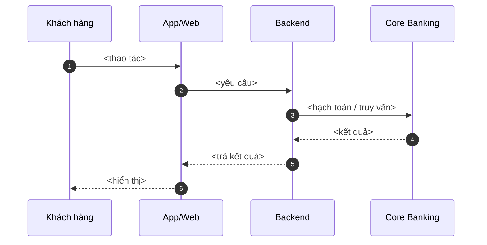
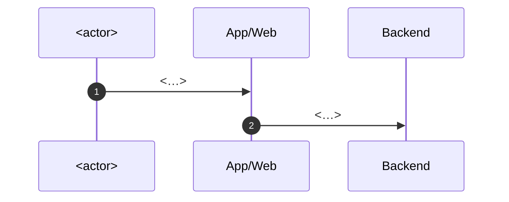
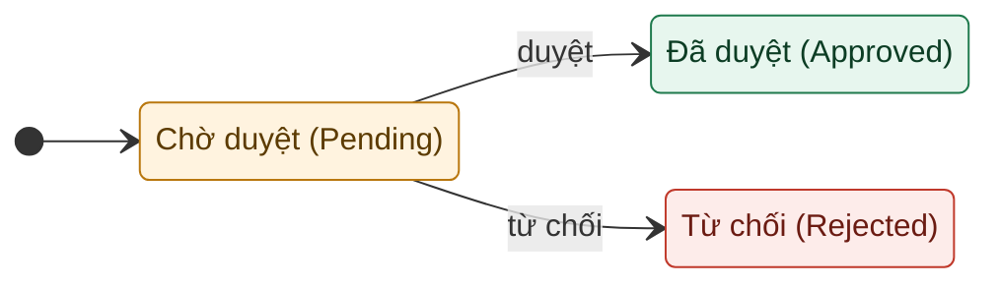

<!-- Generated by Clarify from-idea on <date>. Source: <input>. Output file: clarify-output/urd-draft.md -->
<!-- HEADINGS render in the Document Profile Language (Principle 13.3). Default Language=vi → headings as
     "Tiếng Việt (English term)". IDs / labels (ASSUMPTION/OPEN QUESTION/SUGGESTION) / error codes /
     flow names / field EN names / file names ALWAYS stay English. -->
<!-- DIAGRAMS ARE MERMAID-ONLY (URD): sequence = `sequenceDiagram` + `autonumber`, no color;
     state = `stateDiagram-v2` with colored classDef. No PlantUML. -->

# <Tên phân hệ / nghiệp vụ> — URD Draft

> Bản nháp Clarify ở **altitude nghiệp vụ**, hướng tới một URD hoàn chỉnh. Mục đánh dấu
> `ASSUMPTION` / `OPEN QUESTION` / `SUGGESTION` cần người xác nhận. Clarify **không bịa** business rule.

## Document Profile
<!-- Đọc bởi /clarify:finalize (theo heading này). Chuẩn tài liệu luôn là URD. -->
- Role: <BA | PO>
- Standard: URD
- Domain: <pack name | inferred (no pack — domain items below are labeled)>
- Language: <vi | en | …>   (mọi output render theo ngôn ngữ này; nhãn ASSUMPTION/OPEN QUESTION/
  SUGGESTION và mọi ID giữ tiếng Anh)

## 0. Cách đọc bản nháp (How to read)
### 0.1. Bản này là gì (What this is)
Một URD draft ở altitude nghiệp vụ. **Đọc nhanh:** §6 cách hệ thống vận hành, §7 user stories, §8 quy định,
§14 câu hỏi mở. Trả lời các mục được gắn ID qua Answer Sheet (§18).

### 0.2. Ký hiệu (Symbol conventions)
Mã **ổn định giữa các phiên bản**; tên bên cạnh chỉ để đọc.

| Ký hiệu | Ý nghĩa | Ví dụ |
| --- | --- | --- |
| `F0n-Name` | Một luồng nghiệp vụ (số là anchor ổn định) | `F02-Login` |
| `US-#` | Một user story | `US-01` |
| `BR#` | Một quy định / ràng buộc | `BR3` |
| `ERR-*` | Một mã lỗi | `ERR-TBAL-001` |
| `A#` / `Q#` / `S#` / `V#` | Assumption / Open Question / Suggestion / Variant | `A1` / `Q2` / `S1` / `V1` |

### 0.3. Định nghĩa thuật ngữ (Glossary)
Định nghĩa mỗi thuật ngữ một lần (chỉ thuật ngữ thực sự dùng).

| Thuật ngữ | Giải thích |
| --- | --- |
| <core term> | <giải thích một dòng> |

## 1. Bối cảnh / Vấn đề (Background / problem)
- Hiện trạng: <nhu cầu đang được đáp ứng thế nào hôm nay>
- Vấn đề / cơ hội: <thiếu/sai ở đâu>
- Vì sao bây giờ: <driver / giá trị>
- Kênh trong phạm vi: <mobile / web / branch / back-office / all — hoặc OPEN QUESTION>

## 2. Mục tiêu (Objectives)
Đa góc nhìn — không chỉ "user thao tác → hệ thống phản hồi".

| Góc nhìn | Mục tiêu | Đo bằng |
| --- | --- | --- |
| Khách hàng / End-user | <…> | <…> |
| Nghiệp vụ / Business | <…> | <…> |
| Vận hành / Operations | <…> | <…> |
| Compliance / Risk | <…> | <…> |

## 3. Phạm vi (Scope)
**Trong phạm vi — hướng khách hàng**
- <…>

**Trong phạm vi — back-office / hệ thống**
- <…>

**Ngoài phạm vi**
- <…>

## 4. Nhóm người dùng & Stakeholders (User groups & stakeholders)
Dùng RACI; **ít nhất một dòng (A) Accountable**. Gồm cả nhóm back-office/vận hành.

| Nhóm / Stakeholder | Vai trò (Role) | Nhu cầu / quan tâm | Trách nhiệm (R/A/C/I) |
| --- | --- | --- | --- |
| <business owner> | — | <…> | A |
| <Khách hàng DN> | Maker / Checker / Corp Admin | <…> | R / C / I |
| <Operations / Accounting / Compliance / Risk / Partners / Support> | — | <…> | C / I |

## 5. Ma trận biến thể / Tùy chọn (Variant / Options Matrix — for selection)
Đề xuất để user chọn — **không** mặc định. Chọn theo ID ở Answer Sheet (§18).

| ID | Biến thể | Khác biệt chính |
| --- | --- | --- |
| V1 | <option A> | <…> |
| V2 | <option B> | <…> |

## 6. Cách hệ thống vận hành — tổng quan (How the system works — overview)
Tường thuật end-to-end để nắm toàn cảnh trước khi vào từng nghiệp vụ.
1. <vào qua menu / màn hình …>
2. <chọn / xem điều khoản & thông tin chính>
3. <nhập thông tin / chọn nguồn & tùy chọn>
4. <xem lại: số tiền, ngày, kết quả dự kiến>
5. <chấp nhận điều khoản> → <xác thực: OTP/PIN/biometric>
6. <hệ thống xử lý> → <kết quả: thành công/thất bại>
7. <xem chi tiết / hành động kế tiếp>



## 7. User stories / Use cases
Mỗi dòng: vai trò + mong muốn + lợi ích + tiêu chí chấp nhận. Đây là dạng biểu đạt yêu cầu của URD (§3.2).

| ID | Là (vai trò) | Tôi muốn | Để | Tiêu chí chấp nhận |
| --- | --- | --- | --- | --- |
| US-01 | <vai trò> | <hành động> | <lợi ích> | <điều kiện đạt> |
| US-02 | <…> | <…> | <…> | <…> |

## 8. Quy định & ràng buộc nghiệp vụ (Business rules)
Mỗi rule chưa nêu rõ = `OPEN QUESTION`; mỗi default = `ASSUMPTION`.

| BR id | Quy định (hoặc `OPEN QUESTION`) | Hiệu lực từ / Phiên bản | Áp dụng cho (mới/cũ/cả hai) |
| --- | --- | --- | --- |
| BR1 | <quy định cụ thể> | <date / vN / n/a> | <new/existing/both> |

## 9. Luồng nghiệp vụ & Màn hình (Functional flows & screens)

### 9.1. Danh mục luồng (Flow Catalog)
Cột User stories phải phủ **mọi** `US-#` ở §7 (không US nào không có luồng; orphan flow là finding).

| Flow ID | Tên nghiệp vụ | Actor(s) | Mục tiêu | Quy định (BR) | User stories (US-#) |
| --- | --- | --- | --- | --- | --- |
| F01-<Name> | <…> | <…> | <…> | <…> | <US-01, US-02> |

### 9.2. Luồng F01-<Name> — sơ đồ tuần tự (Mermaid sequence)

**Bảng bước:**

| Bước | Vai trò | Hành động | Mô tả / Kết quả |
| --- | --- | --- | --- |
| 1 | <…> | <…> | <…> |

### 9.3. Danh sách & đặc tả màn hình (Screen matrix & field specs)
Thông tin mỗi màn phải hiển thị và cho người dùng làm gì (mức thông tin, không phải thiết kế pixel). Mỗi
màn một mục con với bảng trường (chi tiết để Dev/QA dùng). M = bắt buộc, O = tùy chọn.

#### Màn hình <Tên màn hình>

> Nền tảng: <Web/Mobile> · Actor: <…> · Mục đích: <…>

| Tên trường (EN) | Tên trường (VN) | Kiểu dữ liệu | M/O | Mô tả / Ràng buộc |
| --- | --- | --- | --- | --- |
| <fieldName> | <Tên trường> | <Text/Number/Dropdown/Date> | <M/O> | <giá trị, validate, mặc định> |

## 10. Trạng thái xử lý (State model)
Phân biệt trạng thái đối tượng nghiệp vụ và trạng thái của thao tác đang xử lý. Chưa rõ → `OPEN QUESTION`.



| Trạng thái (VN) | Trạng thái (EN) | Mô tả | Hành động cho phép |
| --- | --- | --- | --- |
| <…> | <…> | <…> | <…> |

## 11. Thông báo / lỗi & edge case (Messages, errors & edges)
### 11.1. Bảng mã lỗi & thông báo (Error code & message table)
Mã lỗi giữ tiếng Anh (`ERR-<MODULE>-xxx`). Thông điệp người dùng viết đời thường.

| Trường hợp / Mã | Điều kiện xảy ra | Thông báo (VN) | Thông báo (EN) | Xử lý |
| --- | --- | --- | --- | --- |
| `ERR-XXX-001` | <điều kiện> | <…> | <…> | <chặn / fallback / thử lại> |

### 11.2. Edge case không sinh lỗi (Edges without errors)
Boundary / temporal / concurrency / batch xử lý ngầm hoặc theo thiết kế (không mã lỗi).

| Edge | Hành vi mong đợi | Luồng nguồn (F0n-Name) |
| --- | --- | --- |
| <idempotency / replay> | <gọi lặp trả kết quả lần đầu, không nhân đôi> | <F0n-Name> |

## 12. Yêu cầu phi chức năng (Non-functional requirements)
- **Bảo mật:** <xác thực, phân quyền, mã hóa, tuân thủ ND13/2023…>
- **Hiệu năng / đồng bộ:** <real-time, cache, nhất quán số liệu…>
- **Đa ngôn ngữ:** <VN/EN; định dạng số…>
- **Audit log:** <ghi vết gì>

## 13. Giả định (Assumptions)
Còn hiệu lực trừ khi bạn override (trả lời theo ID ở §18).
- **A1** — ASSUMPTION: <default đang dùng>
- **A2** — ASSUMPTION: <…>

## 14. Câu hỏi mở (Open questions)
Trả lời theo ID ở §18. ID giữ ổn định.

| Item | Ảnh hưởng nếu chưa giải quyết | Người phụ trách | Trạng thái | Hạn |
| --- | --- | --- | --- | --- |
| **Q1** — OPEN QUESTION: <…> | <chặn gì / rủi ro> | <→ ask: stakeholder> | open | <date> |

## 15. Đề xuất bổ sung (Suggested additional capabilities)
Khuyến nghị để hoàn thiện — **không** phải scope đã chốt (trả lời theo ID ở §18).
- **S1** — SUGGESTION: <năng lực feature + domain ngụ ý> — lý do: <…>.

## 16. Góc nhìn stakeholder (Stakeholder perspectives)
Ngoài user ↔ system. Một dòng mỗi stakeholder liên quan.

| Stakeholder | Nhu cầu / quan tâm | Tiêu thụ / tạo ra |
| --- | --- | --- |
| operations / accounting / reconciliation / partners / risk / maintenance / data / security | <…> | <…> |

## 17. Truy vết (Traceability — draft)
Mỗi US một lần với nguồn (`A#/BR#/S#/Q#`). Ở finalize, truy vết thể hiện in-document qua Flow Catalog + bảng.

| US id | Flow (F0n-Name) | Business rule | Nguồn (← A#/BR#/S#/Q#) | Trạng thái |
| --- | --- | --- | --- | --- |
| US-01 | F01-<Name> | BR3 | A1 | Active |

## 18. Answer Sheet (sao chép, điền, gửi lại)
Sao chép khối này, điền sau mỗi ID, dán lại — `improve` áp dụng theo ID.
```text
# Variant — chọn một id (xem §5):
Variant: V1
# Assumptions — keep | override: <value>
A1: keep
A2: keep
# Open questions — câu trả lời (hoặc "skip"):
Q1:
# Suggestions — yes | no | later:
S1:
```
