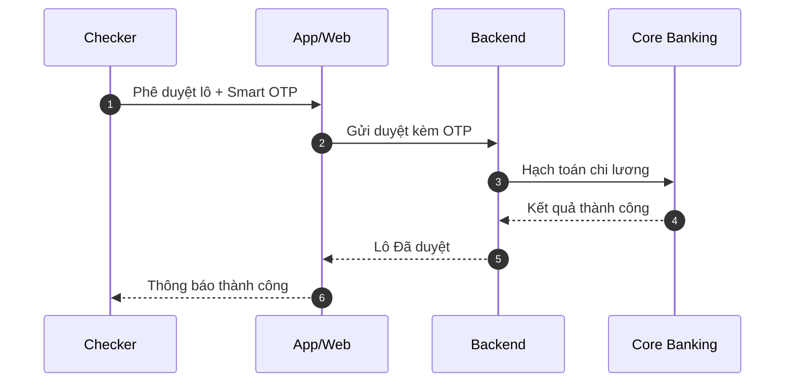

# Clarify

**Trợ lý chất lượng yêu cầu cho BA/PO — biến ý tưởng mơ hồ thành URD ký duyệt được, có điểm số, có truy vết, không bịa nghiệp vụ.**

Clarify là một *agent skill* chạy trong [Claude](https://claude.ai) (Claude Desktop, Claude.ai, hoặc Claude Code). Nó đóng vai một senior BA đồng hành: đặt đúng câu hỏi cho đúng người, soạn **URD (User Requirements Document)** đúng chuẩn template, vẽ sơ đồ Mermaid, dựng wireframe và **chấm điểm chất lượng** tài liệu theo một bộ 36 anti-pattern. Điều nó chưa chắc, nó hỏi; điều bạn chưa quyết, nó chờ.

> 📖 **Hướng dẫn trực quan (GitHub Pages):** **https://ductienuit.github.io/ClarifyBuddy/**
> 📄 **Xem mẫu URD đầy đủ (sơ đồ render ngay trên GitHub):** **[docs/URD-TEMPLATE.md](docs/URD-TEMPLATE.md)**

---

## Mục lục

- [Dành cho ai?](#dành-cho-ai)
- [Clarify giải quyết gì?](#clarify-giải-quyết-gì)
- [Một chuẩn duy nhất: URD](#một-chuẩn-duy-nhất-urd)
- [Cài đặt (5 phút)](#cài-đặt-5-phút)
- [Dùng từng bước](#dùng-từng-bước-step-by-step)
- [6 lệnh](#6-lệnh-the-6-commands)
- [Đầu ra (clarify-output/)](#đầu-ra-clarify-output)
- [Nguyên tắc bất biến](#nguyên-tắc-bất-biến)
- [Cấu trúc repo](#cấu-trúc-repo)

---

## Dành cho ai?

Business Analyst và Product Owner cần soạn **URD** chất lượng cao mà không phải bắt đầu từ trang trắng — đặc biệt mảng ngân hàng/fintech. Bạn không cần biết code.

## Clarify giải quyết gì?

| Vấn đề quen thuộc của BA | Clarify làm gì |
|---|---|
| Ngồi nhìn trang trắng, không biết hỏi gì trước | Hỏi 5 câu chặn phạm vi quan trọng nhất + bảng phương án để bạn **tick chọn** |
| AI viết tài liệu nghe hay nhưng **bịa** quy tắc, con số | Mọi điều chưa chắc đều gắn nhãn `ASSUMPTION` / `OPEN QUESTION` / `SUGGESTION` — không bao giờ tự bịa |
| Tài liệu chỉ tả "user bấm → hệ thống trả lời" | Tự soi thêm góc vận hành, kế toán, đối soát, rủi ro, bảo trì; cấu hình tham số; job chạy nền |
| Không biết tài liệu của mình "đủ tốt" chưa | Chấm **100 điểm / 10 tiêu chí**; còn lỗi nặng thì band tự chặn ở "Not ready for handoff" |
| Phải copy code sơ đồ sang web để xem, tự prompt wireframe | `finalize`/`export` xuất **URD ra HTML/Word** mở ra là thấy: sơ đồ Mermaid render sẵn + wireframe |
| Sửa tài liệu nhiều lần, mất dấu vết quyết định | Lịch sử thay đổi ghi mọi quyết định; finalize tự lưu version, không đè mất bản cũ |

---

## Một chuẩn duy nhất: URD

Clarify chỉ xuất ra **một loại tài liệu — URD** theo khung mẫu chuẩn. Xem **[mẫu URD đầy đủ kèm ví dụ](docs/URD-TEMPLATE.md)**.

| Mục | Nội dung |
|---|---|
| Cover | Bảng thông tin tài liệu (tên dự án, mã, phiên bản, người lập/duyệt, trạng thái) |
| Lịch sử thay đổi | Bảng Change history |
| Mục lục | TOC (bản HTML tự sinh) |
| **§1 Tổng quan** | 1.1 Giới thiệu · 1.2 Đối tượng/Phạm vi · 1.3 Định nghĩa thuật ngữ |
| **§2 Tổng quan hệ thống** | 2.1 Mục tiêu · 2.2 Nhóm người dùng · 2.3 Cách hệ thống vận hành (+ 1 sơ đồ) |
| **Quy ước trình bày sơ đồ** | Quy ước Mermaid (sequence không màu + autonumber; state tô màu) |
| **§3 [Tên nghiệp vụ]** · lặp lại | 3.1 mô tả · 3.2 user stories · 3.3 luồng (sequence) · 3.4 trạng thái (state) · 3.5 quy định · 3.6 màn hình & đặc tả trường · 3.7 lỗi · 3.8 phi chức năng |
| **§4 Phụ lục** | Quy tắc đặt mã + Artifact index & truy vết |
| **§5 Câu hỏi mở** | Bảng gom OPEN QUESTION |

Đặc điểm: sơ đồ **chỉ dùng Mermaid** (sequence + state tô màu); heading song ngữ `Tiếng Việt (English)`; mọi ID/mã (`F0n-Name`, `US-#`, `BR#`, `ERR-*`) giữ tiếng Anh để máy đọc; **một nguồn sự thật** là `urd.md`, mọi bản HTML/Word đều xuất ra từ đó.

Sơ đồ §3.3/§3.4 render thẳng trên GitHub, ví dụ:



---

## Cài đặt (5 phút)

### Cách 1 — Claude Desktop / Claude.ai *(khuyên dùng cho BA/PO)*

1. Tải các gói skill `.zip` trong thư mục [`build/`](build/) (gói router `clarify.zip` và các gói lệnh chuyên biệt). Bấm vào từng file → **Download**.
2. Trong Claude: **Settings → Capabilities → Skills → Upload skill**, tải lần lượt từng `.zip` (bật *Code execution* nếu được hỏi).
3. Mở một cuộc chat và gõ tự nhiên, ví dụ: *"clarify: tôi muốn làm URD cho tính năng gửi tiết kiệm online"*.

> Không nhớ nên dùng skill nào? Cứ chọn **`clarify`** (router) — nó tự chẩn đoán nhu cầu và định tuyến cho bạn.

### Cách 2 — Claude Code *(cho người làm việc trong repo)*

1. Clone repo này và mở trong [Claude Code](https://docs.claude.com/en/docs/claude-code):
   ```bash
   git clone https://github.com/ductienuit/ClarifyBuddy.git
   ```
2. Claude Code tự nhận 6 slash command dưới đây. Mọi sản phẩm được ghi vào thư mục `clarify-output/`.

---

## Dùng từng bước (step by step)

Hành trình chuẩn: **idea → improve (hỏi/đáp) → finalize → export.** Ví dụ xuyên suốt: *"tính năng mở sổ tiết kiệm online"*.

**1. Định hình ý tưởng — `/clarify:from-idea`**
Mô tả ý tưởng bằng một câu. Clarify lập **Document Profile** (vai trò BA/PO · chuẩn URD · domain · ngôn ngữ, mặc định `vi`) rồi hỏi tối đa 5 câu chặn phạm vi và đưa **bảng phương án (Variant Matrix)** để bạn chọn. Bạn nhận về **URD draft** + một **Answer Sheet** (khối câu hỏi có mã `Q1`, `A1`, `S1`, `V1`… để bạn trả lời).

**2. Trả lời & chốt — `/clarify:improve answers`**
Copy Answer Sheet, điền sau mỗi mã, dán lại. Clarify áp từng quyết định: câu trả lời thành rule đã chốt, đề xuất được duyệt vào phạm vi. Mọi quyết định ghi vào bảng Decisions made + Lịch sử thay đổi. Lặp đến khi hết câu hỏi lớn. (Các mode khác: `business-rules`, `edge`, `stories`, `model`, `nfr`, `traceability`…)

**3. (Tuỳ chọn) Chấm điểm — `/clarify:audit`**
Chấm 100 điểm / 10 tiêu chí + danh sách anti-pattern, bất cứ lúc nào.

**4. Chốt tài liệu — `/clarify:finalize`**
Biên soạn URD ký duyệt `urd.md` theo template chuẩn, đồng thời render `urd.html` (mặc định). Thêm `/clarify:finalize word` để có `urd.docx`. Chạy lại không đè mất bản cũ (tự lưu `urd.v1.md`, tăng version).

**5. Xuất bản — `/clarify:export`**
Render **toàn bộ URD ra HTML** (`urd.html`) **từ `urd.md`**: mở bằng trình duyệt là thấy sơ đồ Mermaid render sẵn, bảng gộp ô theo nhóm, mục lục, wireframe low-fi. Thêm `word` để xuất `urd.docx` (qua LibreOffice), `offline` để xem không cần mạng.

**6. Khi cần — `status`, `change-request`**
`/clarify:status` cho biết bạn đang ở đâu, còn gì tồn đọng. `/clarify:improve change-request` phân tích tác động của một thay đổi qua chuỗi truy vết.

---

## 6 lệnh (The 6 commands)

| Lệnh | Dùng khi |
|---|---|
| `/clarify:from-idea` | Chỉ có một ý tưởng / mô tả ngắn → URD draft |
| `/clarify:improve` | Trả lời Answer Sheet (`answers`), nâng cấp một mục, hoặc phân tích `change-request` |
| `/clarify:audit` | Chỉ muốn chấm điểm + danh sách lỗi |
| `/clarify:finalize` | Chốt URD ký duyệt (`urd.md` + `urd.html`; `word` để có `urd.docx`) |
| `/clarify:export` | Render URD ra HTML / Word / offline |
| `/clarify:status` | Xem mình đang ở đâu trong pipeline |

---

## Đầu ra (`clarify-output/`)

Bộ deliverable **tinh gọn** — phân tích (user stories, edge, lỗi, sơ đồ, truy vết, quyết định) nằm **bên trong** tài liệu, không thành file rời.

| File | Là gì | Sinh bởi |
|---|---|---|
| `urd-draft.md` | Bản nháp URD kèm Answer Sheet | from-idea |
| `audit-report.md` | Điểm /100, band, findings kèm cách sửa | audit |
| `change-impact.md` | Phân tích tác động change request | improve change-request |
| `urd.md` (+ `urd.v1.md, .v2…`) | Tài liệu URD ký duyệt, có version (không đặt tên "final") | finalize |
| `urd.html` | Toàn bộ URD render từ `urd.md`: sơ đồ Mermaid, bảng gộp ô, mục lục, wireframe | finalize / export |
| `urd.docx` | Bản Word render từ `urd.md` (qua LibreOffice) | finalize word / export word |
| `wireframes.html` | Wireframe low-fi HTML | finalize / export |

---

## Nguyên tắc bất biến

**Không bịa nghiệp vụ.** Con số, quy tắc, mã lỗi là quyết định của tổ chức bạn — Clarify đề xuất khung, gắn nhãn những gì chưa chắc, và chỉ ra *cần hỏi ai*. Chất lượng tài liệu cuối phụ thuộc nhiều nhất vào việc bạn trả lời Answer Sheet đầy đủ.

## Cấu trúc repo

```
.claude/commands/clarify/   # 6 slash-command adapters (Claude Code)
.clarify/                   # bộ skill pack:
  workflows/                # quy trình cho từng lệnh
  engine/                   # 12 imperative engines
  templates/                # 13 output shapes (gồm final-urd-template, urd-pack-template.html)
  anti-patterns/            # 36-entry anti-pattern catalog + rubric chấm điểm
  domain-packs/             # gói kiến thức ngành (fintech, ecommerce, saas-b2b)
skills/                     # nguồn cho từng gói skill chuyên biệt (Claude Desktop)
build/                      # các file .zip cài đặt sẵn cho Claude Desktop
docs/                       # trang hướng dẫn (GitHub Pages) + mẫu URD (URD-TEMPLATE.md)
examples/                   # ví dụ minh hoạ
```

Đóng gói lại các zip sau khi sửa skill (cần PowerShell): `pwsh ./build-skill.ps1`.
Chi tiết đóng góp: [CONTRIBUTING.md](CONTRIBUTING.md) · Lịch sử thay đổi: [CHANGELOG.md](CHANGELOG.md).

## License

[MIT](LICENSE)
