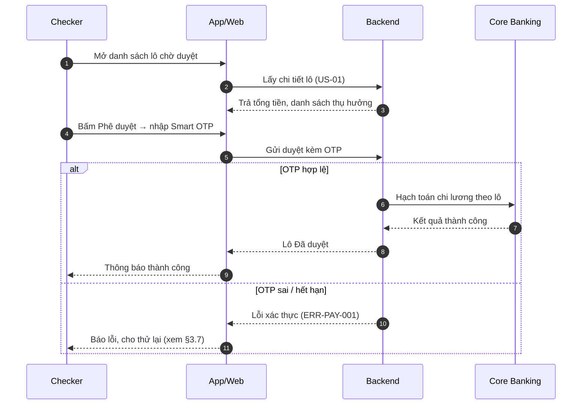
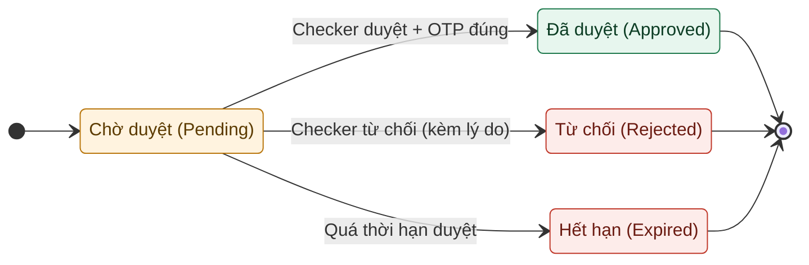

# Mẫu URD (User Requirements Document)

> Đây là **khung tài liệu duy nhất** mà Clarify xuất ra. `finalize` tạo `urd.md` theo đúng
> khung này; `export` render ra `urd.html` / `urd.docx`. Nguồn template: [`.clarify/templates/final-urd-template.md`](../.clarify/templates/final-urd-template.md).

Tài liệu này hiển thị **cấu trúc đầy đủ** + một **ví dụ điền mẫu** cho một nghiệp vụ, để bạn thấy
URD trông như thế nào. Sơ đồ Mermaid bên dưới render trực tiếp trên GitHub.

---

## 1. Quy ước chung

| Quy ước | Nội dung |
|---|---|
| **Một chuẩn** | Chỉ có URD — không còn BRD/PRD. |
| **Ngôn ngữ** | Mặc định tiếng Việt; heading render song ngữ `Tiếng Việt (English)`. |
| **Mỏ neo tiếng Anh** | Mọi ID/mã giữ tiếng Anh để máy đọc: `F0n-Name`, `US-#`, `BR#`, `ERR-*`, `A#/Q#/S#/V#`, tên trường EN, tên file. |
| **Sơ đồ** | **Chỉ Mermaid.** §3.3 `sequenceDiagram` + `autonumber`, không tô màu. §3.4 `stateDiagram-v2`, tô màu bằng `classDef`. Không dùng PlantUML. |
| **Không bịa** | Chưa rõ → `ASSUMPTION` / `OPEN QUESTION`; nên có thêm → `SUGGESTION`. |
| **Một nguồn sự thật** | `urd.md` là master; HTML/Word đều render từ nó. |

## 2. Khung mục (skeleton)

```
Cover — Thông tin tài liệu (Document control)
Lịch sử thay đổi (Change history)
Mục lục (Table of contents)
1. Tổng quan (Overview)
   1.1 Giới thiệu · 1.2 Đối tượng/Phạm vi · 1.3 Định nghĩa thuật ngữ (+ ký hiệu)
2. Tổng quan về hệ thống (System overview)
   2.1 Mục tiêu · 2.2 Nhóm người dùng · 2.3 Cách hệ thống vận hành (tổng quan + 1 sơ đồ)
Quy ước trình bày sơ đồ (Diagram conventions)
3. [Tên nghiệp vụ] — LẶP LẠI cho mỗi nghiệp vụ
   3.1 Mô tả · 3.2 User stories · 3.3 Luồng (sequence) · 3.4 Trạng thái (state)
   3.5 Quy định & ràng buộc · 3.6 Màn hình & đặc tả trường · 3.7 Thông báo/lỗi · 3.8 Phi chức năng
4. Phụ lục (Appendix) — 4.1 Quy tắc đặt mã · 4.2 Artifact index & truy vết
5. Câu hỏi mở (Open questions)
Phê duyệt (Sign-off)
```

---

## 3. Ví dụ điền mẫu (một nghiệp vụ)

Ví dụ rút gọn cho nghiệp vụ **Phê duyệt chuyển tiền lương (Payroll approval)** để minh hoạ cách
mỗi mục được điền.

### Thông tin tài liệu (Document control)

| Hạng mục | Nội dung |
|---|---|
| Tên dự án | Digital Banking — Khối KHDN |
| Mã tài liệu | URD-08-PheDuyet-ChuyenTienLuong-v1.0 |
| Phiên bản | 1.0 |
| Ngày lập | 21/06/2026 |
| Người lập (BA) | BA Khối KHDN |
| Trạng thái | Draft — chưa duyệt |
| Quality stamp | score 82/100 — band: Good, minor gaps |

### 3.1 Mô tả nghiệp vụ (Description)

| Tiêu chí | Mô tả chi tiết |
|---|---|
| Mục tiêu | Checker phê duyệt/từ chối lô lệnh chi lương do Maker tạo, trên Mobile |
| Phạm vi áp dụng | Khách hàng doanh nghiệp; nền tảng Mobile App |
| Đối tượng sử dụng | Maker (tạo lệnh), Checker (phê duyệt) |
| Nền tảng | Mobile |

### 3.2 User stories / Use cases

| ID | Là (vai trò) | Tôi muốn | Để | Tiêu chí chấp nhận |
|---|---|---|---|---|
| US-01 | Checker | xem chi tiết lô lệnh chờ duyệt | nắm thông tin trước khi duyệt | Hiển thị tổng số GD, tổng tiền, danh sách người thụ hưởng |
| US-02 | Checker | phê duyệt lô bằng Smart OTP | hoàn tất duyệt an toàn | Nhập OTP đúng → lô chuyển `Đã duyệt`; sai 3 lần → khoá tạm |
| US-03 | Checker | từ chối kèm lý do | Maker biết cần sửa gì | Chọn lý do → lô về `Từ chối`, Maker nhận thông báo |

### 3.3 Luồng xử lý nghiệp vụ (Process flow)



| Bước | Vai trò | Hành động | Mô tả xử lý / Kết quả |
|---|---|---|---|
| 1 | Checker | Mở danh sách lô | Hiển thị các lô ở trạng thái `Chờ duyệt` |
| 2–3 | App → Backend | Lấy chi tiết lô | Tổng tiền + danh sách thụ hưởng (US-01) |
| 4–5 | Checker | Phê duyệt + Smart OTP | Xác thực trước khi hạch toán (BR2) |
| 6–9 | Core Banking | Hạch toán | Trả kết quả → lô `Đã duyệt` |

Quy định: BR1, BR2 (§3.5). Lỗi / thông báo / xử lý: §3.7.

### 3.4 Trạng thái xử lý (State model)



| Trạng thái (VN) | Trạng thái (EN) | Mô tả | Hành động cho phép |
|---|---|---|---|
| Chờ duyệt | Pending approval | Maker đã tạo, chờ Checker | Maker: hủy |
| Đã duyệt | Approved | Checker duyệt, gửi Core hạch toán | — |
| Từ chối | Rejected | Checker từ chối kèm lý do | Maker: tạo lại |
| Hết hạn | Expired | Quá thời hạn duyệt → tự hủy | — |

### 3.5 Quy định & ràng buộc nghiệp vụ (Business rules)

- **BR1 —** Tối đa 500 giao dịch/lô; vượt phải tách lô.
- **BR2 —** Phê duyệt bắt buộc xác thực Smart OTP; sai 3 lần → khoá tạm 15 phút.
- **BR3 —** Lô quá hạn duyệt N ngày → tự chuyển `Hết hạn`. *(N: `OPEN QUESTION` — hỏi Vận hành.)*

### 3.6 Danh sách & đặc tả màn hình (Screens & field specs)

#### 3.6.1 Màn hình Chi tiết lô chờ duyệt

> Nền tảng: Mobile · Actor: Checker · Mục đích: Xem chi tiết lô trước khi duyệt.

| Tên trường (EN) | Tên trường (VN) | Kiểu dữ liệu | M/O | Mô tả / Ràng buộc |
|---|---|---|---|---|
| batchId | Mã lô | Text | M | Mã định danh lô lệnh |
| totalCount | Tổng số giao dịch | Number | M | ≤ 500 (BR1) |
| totalAmount | Tổng số tiền | Number | M | Định dạng theo loại tiền |
| beneficiaryList | Danh sách thụ hưởng | List | M | Tên, số TK, số tiền từng dòng |
| approveBtn | Nút Phê duyệt | Button | M | Mở luồng nhập Smart OTP |
| rejectReason | Lý do từ chối | Dropdown | O | Bắt buộc khi từ chối |

### 3.7 Thông báo / lỗi / exception cases (Messages & errors)

| Trường hợp / Mã | Điều kiện xảy ra | Thông báo (VN) | Thông báo (EN) | Xử lý |
|---|---|---|---|---|
| `ERR-PAY-001` | Smart OTP sai hoặc hết hạn | Mã OTP không đúng hoặc đã hết hạn. Vui lòng thử lại. | The OTP is incorrect or expired. Please try again. | Cho thử lại; sai 3 lần khoá tạm (BR2) |
| `ERR-PAY-002` | Core Banking timeout khi hạch toán | Giao dịch đang được xử lý. Vui lòng kiểm tra lại sau. | The transaction is being processed. Please check again later. | Giữ trạng thái Processing; không báo thành công sai |

### 3.8 Yêu cầu phi chức năng (Non-functional requirements)

- **Bảo mật:** Xác thực Smart OTP; phân quyền Maker–Checker (4-eyes); ghi Audit Log theo ND13/2023.
- **Hiệu năng:** Tải chi tiết lô < 2s; hạch toán đồng bộ kết quả real-time.
- **Đa ngôn ngữ:** VN/EN.
- **Audit log:** Ghi vết hành động duyệt/từ chối kèm người thực hiện và thời điểm.

---

## 4. Phụ lục (Appendix)

### 4.1 Quy tắc đặt mã
- Mã lỗi theo `ERR-<MODULE>-xxx` (ví dụ `ERR-PAY-001`).

### 4.2 Artifact index & truy vết

| Artifact | Dùng khi | Đường dẫn |
|---|---|---|
| Nguồn (URD) | Mọi chỉnh sửa | `clarify-output/urd.md` |
| Audit report | Kiểm tra chất lượng | `clarify-output/audit-report.md` |
| Bản HTML | Đọc/chia sẻ | `clarify-output/urd.html` |
| Bản Word | Đọc/ký | `clarify-output/urd.docx` |

Truy vết trong tài liệu: **US-01..03 ↔ Flow F01-Approve ↔ BR1/BR2/BR3 ↔ ERR-PAY-001/002**.

## 5. Câu hỏi mở (Open questions)

| # | Câu hỏi / điểm cần làm rõ | Người phụ trách | Trạng thái |
|---|---|---|---|
| 1 | OPEN QUESTION: Thời hạn duyệt N ngày trước khi tự `Hết hạn` (BR3)? | Vận hành | Open |

## Phê duyệt (Sign-off)

| Người duyệt | Vai trò | Quyết định | Ngày |
|---|---|---|---|
| … | Business Owner | … | … |
